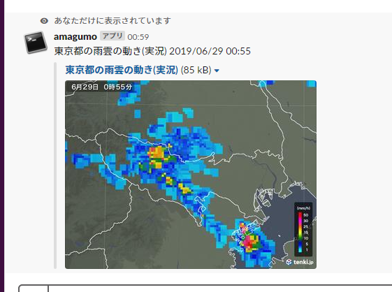

# amagumocheck
Slack slash command for acquiring rain cloud information in Japan from tenki.jp.

If you assign the URL of this command https://amagumocheck.atarumix.vercel.app to "/amagumo" by slack 'slash commands',
The following results can be obtained with 
`/amagumo tokyo`.

If you want to change a default location, append the location name to the end of the URL for 'slash commands'.
Just like `https://amagumocheck.atarumix.vercel.app/hiroshima`.

## License
MIT
